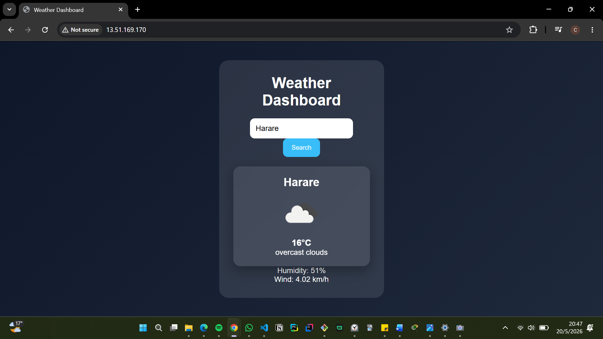

# Weather Dashboard
A responsive weather dashboard built using HTML, CSS, and JavaScript that fetches real-time weather data from the OpenWeather API. The app allows users to search for any city and view current temperature, weather conditions, and icons dynamically updated on the UI.

This project demonstrates API integration, DOM manipulation, and frontend development fundamentals. It was also deployed on an AWS EC2 instance using Nginx, showcasing basic cloud deployment and server configuration skills.

## Live Demo
Check out the live project here:
http://13.51.169.170

## Preview

## Features
- Search weather by city name
- Real-time API data integration
- Dynamic weather icons
- Responsive user interface
- Error handling for invalid cities
- Cloud deployment on AWS EC2

## Technologies Used
- HTML5
- CSS3
- JavaScript (Vanilla JS)
- OpenWeather API
- Git & GitHub
-AWS EC2
- Nginx Web Server

## Deployment
The project is hosted on an Amazon EC2 Linux instance using Nginx as the web server. Files were deployed using SCP and managed through Linux terminal commands.

# What I Learned
- Working with REST APIs
- DOM manipulation in JavaScript
- Handling asynchronous functions (fetch/async-await)
- Deploying a website on a cloud server
- Using SSH and SCP for remote file management
- Basic Linux server management

# Author
Built by Chiedza | Computer Science Student
